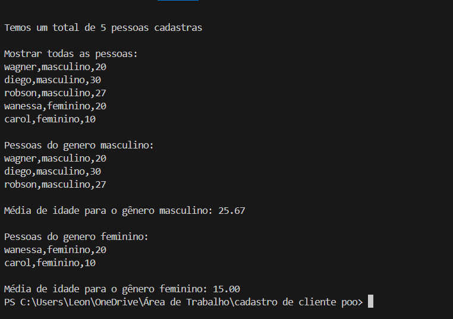

# Gestão de Cadastro de Pessoas com POO

## Descrição
Este software foi desenvolvido para realizar a gestão de cadastro de pessoas utilizando Programação Orientada a Objetos (POO). A aplicação permite:
- **Cadastro de pessoas** com nome, gênero e idade.
- **Exibição de informações** gerais do cadastro.
- **Filtragem de pessoas por gênero**.
- **Cálculo da média de idade** por gênero.

## Objetivo
Implemanta e aprimorar o uso de POO , facilitar a gestão e análise de dados cadastrais de pessoas, destacando o uso de classes para modularidade, reaproveitamento de código, abstração, encapsulamento, herança e os demais conceitos de Programação Orientada a Objetos.

## Estrutura do Software
A aplicação está organizada em duas classes principais:

### 1. **Classe `Pessoa`**
Responsável por armazenar e manipular os dados individuais de uma pessoa.

#### Atributos
- `nome`: Nome da pessoa.
- `genero`: Gênero da pessoa (masculino/feminino).
- `idade`: Idade da pessoa.

#### Método
- `pessoa_info()`: Exibe as informações de uma pessoa no formato `nome, gênero, idade`.

### 1. **Classe `Cadastro`**
Gerencia uma lista de pessoas e oferece funcionalidades de análise e exibição.

#### Atributos
- `lista`: Lista que armazena os objetos da classe Pessoa.

#### Métodos
- `acadastrr(nova_pessoa)`: Adiciona uma nova pessoa à lista.
- `mostra()`: Exibe todas as pessoas cadastradas.
- `listar_por_genero()`: Lista todas as pessoas de um determinado gênero.
- `media_idade_por_genero()`: Calcula e exibe a média de idade de um gênero específico.

.

